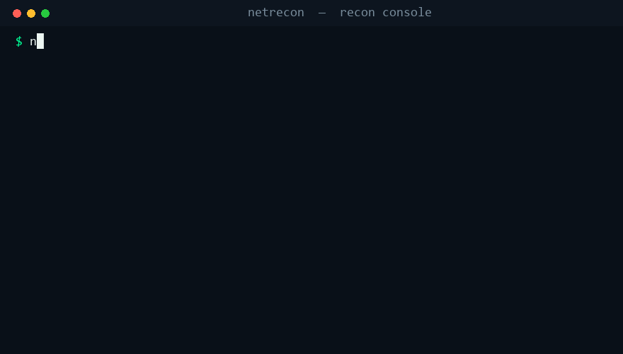
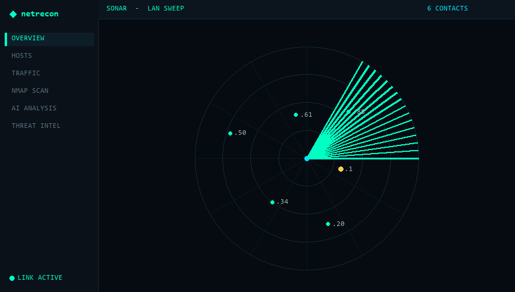

# netrecon

[](https://github.com/terrillhilliard/netrecon/actions/workflows/ci.yml)


**Network reconnaissance, monitoring & threat-intel — a fast, dependency-light Python toolkit with a live web console.**

<p align="center"></p>

`netrecon` discovers hosts, scans ports and service versions, watches for new
devices and ARP-spoof attacks, captures traffic, looks up live CVEs, and writes a
**full AI security report after every scan** — major vulnerabilities, known CVEs,
real-world attack examples, and how to patch or mitigate — all served in a
**liquid-glass web console** and backed by a local SQLite asset inventory.
The core needs **no admin, no Npcap, no third-party packages**; optional extras
(`rich`, `scapy`, `mac-vendor-lookup`) unlock nicer output, MITM, and vendor names.

> **For authorized, ethical security testing only** — run it on networks you own
> or have explicit permission to assess. The offensive modules (ARP-spoof MITM,
> DNS spoofing) are active attacks and are gated behind clear warnings.

> Built by **Terrill Hilliard** — IT Support & Security Operations · M.S. Cybersecurity · CySA+ / PenTest+.
> **Live demo:** https://recon-console-theta.vercel.app

---

## Commands

| Command | What it does |
|---|---|
| `netrecon gui` | Point-and-click launcher window (buttons for everything) |
| `netrecon scan` | Discover hosts → async TCP port scan → enrichment → **AI security report** (`--no-ai-summary` to skip) |
| `netrecon serve` | **Web console** on the netrecon engine (dashboard + REST API) |
| `netrecon hosts` | The accumulated SQLite asset inventory |
| `netrecon watch` | Continuous rescan; alert on new devices (`--ntfy` for phone push) |
| `netrecon arpwatch` | **Detect ARP-spoofing / MITM** — passive, no admin, works on Wi-Fi |
| `netrecon monitor` | Passive flow + DNS capture (raw socket; admin) |
| `netrecon mitm <ip>` | ARP-spoof MITM + capture + **DNS spoofing** (`--dns-spoof`) + AI summary on stop (Scapy; admin; **wired Ethernet**) |
| `netrecon flows` / `dns` | View captured traffic / DNS queries |
| `netrecon vulns [svc]` | **Live CVE lookup (NIST NVD)** for a service or the whole inventory |
| `netrecon ingest` / `alerts` | Pull Suricata/Zeek logs into the store & query IDS alerts |
| `netrecon interfaces` | List adapters; auto-prefers wired, `--iface` to switch |

## Web console (`netrecon serve`)

A self-contained **liquid-glass** dashboard, mobile-responsive, running on your
real data:

<p align="center"></p>

- **Overview** — sonar radar, on-device analyzer, router/ISP intel
- **Hosts** — drill-down drawer with one-click **MITM** and copyable CLI
- **Nmap Scan** — open ports **with detected versions**
- **Traffic** — router-link telemetry, live bytes/sec, captured DNS/HTTP
- **AI Analysis** — chat that answers questions about your network and hunts
  **vulnerabilities/exploits**, grounded in **live NVD CVE data** for detected versions
- **AI Report** — a full security report auto-written after each scan (major
  vulnerabilities, **CVE IDs + CVSS**, real-world attack examples, and the exact
  fix/mitigation) plus a **MITM results** summary of what an intercepted device did
- **ARP-spoof banner** — a red alert across the top the moment a MITM is detected

## Requirements

The **core runs on the Python standard library alone** — no third-party packages,
no packet driver, and no admin are needed to `scan`, `serve`, `watch`, or `arpwatch`.
The items below add polish and unlock capture/MITM.

| Requirement | Needed for | Notes |
|---|---|---|
| **Python ≥ 3.9** | everything | the only hard requirement |
| `rich` ≥ 13 | polished CLI tables/output | optional — installed by `pip install -e .` |
| `mac-vendor-lookup` ≥ 0.1.12 | MAC → vendor names | optional |
| `scapy` ≥ 2.5 | `mitm`, `monitor` capture | optional |
| **Npcap** (Windows) / **libpcap** (Linux/macOS) | packet capture (`mitm` / `monitor`) | not needed for scan/serve/watch/arpwatch |
| **Admin / root** | `monitor`, `mitm` (raw sockets) | discovery, serve, arpwatch need no admin |
| **Wired Ethernet** | `mitm` only | most Wi-Fi adapters can't ARP-spoof (the AP mediates L2) |

**Optional API keys** (set as an env var, or pass `serve --*-key`) — all use the
stdlib only, no extra packages:

| Env var | Unlocks |
|---|---|
| `ANTHROPIC_API_KEY` | AI Analysis chat + the AI Report (scan & MITM summaries) |
| `NVD_API_KEY` | higher rate limit for live CVE lookups |

Python dependencies are pinned in [`requirements.txt`](requirements.txt) and
[`pyproject.toml`](pyproject.toml). Dev extras (`pytest`, `ruff`) install with
`pip install -e ".[dev]"`.

## Install

```bash
git clone https://github.com/terrillhilliard/netrecon
cd netrecon
python -m venv .venv
.venv\Scripts\activate           # Windows   (source .venv/bin/activate on *nix)
pip install -e .                 # installs rich, mac-vendor-lookup, scapy
```

**Packet driver (for `mitm` / `monitor` capture):** [Npcap](https://npcap.com) on
Windows, or `libpcap` on Linux/macOS. Everything else — scan, serve, watch,
arpwatch, CVE lookups — needs no driver and no admin.

**Optional API keys** (env vars or `serve --*-key`): `ANTHROPIC_API_KEY` (AI chat +
AI Report), `NVD_API_KEY` (raises the CVE lookup rate limit). All AI/CVE calls use
only the stdlib.

## Usage

```bash
netrecon scan --banners                     # hosts, ports, versions + AI security report
netrecon serve                              # dashboard at http://127.0.0.1:8081
netrecon arpwatch --ntfy my-lan             # get pinged if someone MITMs you
netrecon vulns "OpenSSH 8.4"                 # live CVEs for a service
netrecon watch --iface Wi-Fi                # keep scanning + alert on new devices

# Authorized red-team primitives (admin + wired Ethernet; ETHICAL USE ONLY):
netrecon mitm 192.168.1.50                  # ARP-spoof MITM + AI traffic summary on stop
netrecon mitm 192.168.1.50 --dns-spoof login.example.com=192.168.1.9   # DNS spoof one domain
```

## Roadmap

| Phase | Capability | Status |
|-------|-----------|--------|
| 0.1–0.4 | discovery · port scan · monitor · watch · SIEM ingest · web console | ✅ done |
| 0.5 | rebrand · MITM · AI analyst · liquid-glass UI | ✅ done |
| 0.6 | GUI launcher · Threat Intel · service versions · CVE-aware AI | ✅ done |
| 0.7 | ARP-spoof detector · mobile UI · **live NVD/CVE feed** | ✅ done |
| **1.0** | **AI security report per scan** (CVEs + real attacks + fixes) · **DNS spoofing** · MITM AI summary | ✅ **released** |
| next | anomaly scoring · exploit-availability enrichment | planned |

## Legal

Only scan, monitor, or MITM networks you own or are explicitly authorized to
test. Unauthorized use may be illegal in your jurisdiction. For defensive
security, asset management, and authorized assessment only.

MIT © 2026 Terrill Hilliard
